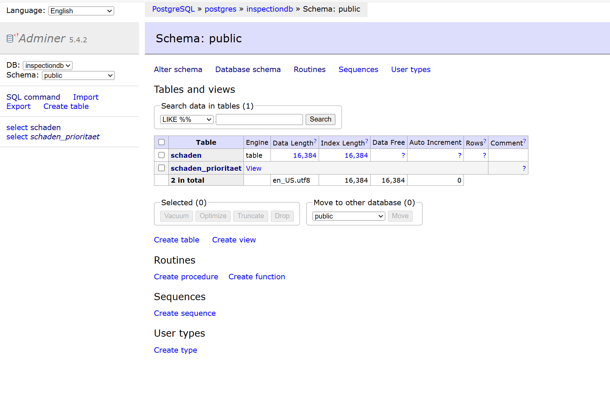

# 🌉 Digitale Brücken-Prüfung  
## Vom DIN-1076-Prüfbericht zur automatischen Prioritätenliste  
**Docker · PostgreSQL · Datenmodellierung · Proof of Concept**

---

## Proof of Concept (PoC)

Dieses Repository stellt einen konzeptionellen und technischen Demonstrator dar.  
Ziel ist die strukturierte Digitalisierung von Prüfprozessen im Ingenieurbau.

Es handelt sich nicht um ein produktives System,  
sondern um einen fachlich und technisch nachvollziehbaren Prototyp  
zur Illustration moderner Datenmodellierung im öffentlichen Sektor.

---

## Executive Summary

Dieses Projekt demonstriert, wie DIN-1076-Prüfberichte  
in strukturierte, auswertbare Daten überführt werden können.

Durch relationale Modellierung und automatische Prioritätsberechnung  
entsteht eine transparente Entscheidungsgrundlage  
für Instandhaltungsmaßnahmen im öffentlichen Infrastrukturmanagement.

Der Fokus liegt auf:
- Nachvollziehbarkeit  
- Wartbarkeit  
- realistischer Umsetzbarkeit  

---

## Ausgangssituation

In klassischen Prüfberichten werden Schäden  
(z. B. fehlende Nietköpfe oder Korrosionsstellen)  
als Freitext in PDF-Dokumenten beschrieben.

Die Bewertung (S / V / D) ist vorhanden,  
wird jedoch meist manuell gelesen und weiterverarbeitet.

Das führt zu:

- hohem Zeitaufwand  
- Medienbrüchen (PDF → Excel)  
- fehlender Transparenz  
- erschwerter Vergleichbarkeit  

---

## Ziel des Projekts

- Prüfberichte **digital strukturieren**
- Schäden **zentral speichern**
- Prioritäten **automatisch berechnen**
- Entscheidungsprozesse **vereinfachen**

**Leitsatz:**  
> *Ich behandle Ingenieurwissen als Datenmodell – nicht als Handwerk.*

---

## Lösungskonzept (vereinfacht)

### 1. Struktur statt Freitext
Ein exemplarischer Schaden  
(z. B. Schaden 169: fehlender Nietkopf)  
wird aus dem Prüfbericht in ein strukturiertes Datenmodell überführt.

### 2. Relationale Speicherung
Die Schadensdaten werden in einer PostgreSQL-Datenbank gespeichert:

- Schadens-ID  
- Bauteil  
- Standort  
- Bewertung (S, V, D)  

### 3. Automatische Priorisierung
Eine SQL-View berechnet automatisch:

```text
Priorität = S + V + D
```

Die Prioritätenliste wird dynamisch erzeugt –
ohne manuelle Nachbearbeitung.
So ist sofort sichtbar, welche Schäden zuerst bearbeitet werden müssen.

---

## Technischer Überblick

### Architektur (vereinfacht)

Prüfbericht (PDF / Text)  
↓  
Strukturierte Erfassung der Schäden  
↓  
PostgreSQL-Datenbank (relationale Speicherung)  
↓  
SQL-Views (automatische Prioritätsberechnung)  
↓  
Management-Übersicht / Entscheidungsgrundlage  

---

## KI-Komponente (Demonstrator)

Im Ordner `src/ai` befindet sich eine exemplarische Textklassifikation
(`prototype_text_classification.py`).

Diese dient als Demonstrator, um zu zeigen,
wie Prüfberichtstexte automatisiert analysiert und kategorisiert werden könnten.

Die KI-Komponente ist bewusst nicht produktionsreif implementiert.
Sie soll das Potenzial von KI als unterstützendes Analysewerkzeug verdeutlichen –
nicht als Ersatz für die fachliche Bewertung durch Ingenieure.

---

### Eingesetzte Technologien

- **Docker**  
  Stellt die komplette Umgebung reproduzierbar mit einem Befehl bereit.

- **PostgreSQL**  
  Speichert die strukturierten Schadensdaten in relationaler Form.

- **SQL-Views**  
  Berechnen automatisch die Priorität (S + V + D) und erzeugen eine dynamische Auswertung.

---

## Ergebnis
- Ein Schaden ist nicht mehr nur Text, sondern ein **digitaler Datensatz**
- Prioritäten sind **objektiv und sofort sichtbar**
- Das System ist **wiederholbar** und leicht erweiterbar

---

## Beispiel-Ausgabe

### Tabellenübersicht

<p align="center">
  
</p>

### Prioritätenliste

<p align="center">
  
</p>

---

## Relevanz für den öffentlichen Sektor

- Zeitersparnis bei der Auswertung von Prüfberichten
- Einheitliche und nachvollziehbare Priorisierung
- Verbesserte Planbarkeit von Instandhaltungsmaßnahmen
- Transparente Dokumentation für interne und externe Prüfungen

---

## Projektfokus
Dieses Projekt ist ein strukturiertes Digitalisierungs-Proof-of-Concept
im Kontext öffentlicher Infrastruktur und kommunaler Bauwerksverwaltung.

Es zeigt, wie Fachwissen, IT und Prozesslogik
zu einer klaren, belastbaren Entscheidungsgrundlage verbunden werden können.

## Projekt-Dokumentation
📄 
- [01 – Kurz-Portfolio (PDF)](docs/Portfolio/01_Digitale_Brueckenpruefung_Portfolio.pdf)
- [02 – Prozessdigitalisierung und DMS](docs/Portfolio/02_Prozessdigitalisierung_und_DMS.md)
- [03 – Systemlogik und Automatisierung](docs/Portfolio/03_Systemlogik_und_Automatisierung.md)
- [04 – Projektmanagement_und_Workshops](docs/Portfolio/04_Projektmanagement_und_Workshops.md)
- [05 – Digitalisierung_und_KI_Use_Cases](docs/Portfolio/05_Digitalisierung_und_KI_Use_Cases.md)

